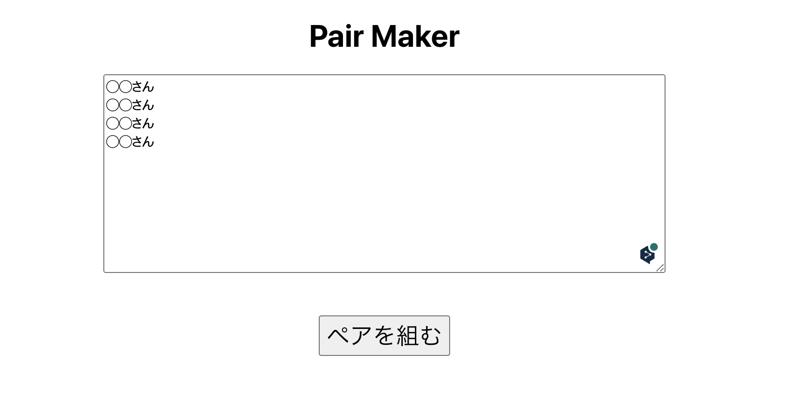

# PairMaker

> _Automate making a list of pairs and reduce workload_

# Motivation

Reduce workload for B2B instructors making pairs.

This app will:

- If you enter the student's name and then run the application, it will automatically update Google Spreadsheet with results (pairs of 20 days)

# ⚙️ Getting Started

Before running any scripts, you'll need additional setups. After 3 steps, you should run the next command.

```shell
$ yarn install
$ yarn dev
```

Steps:

1. Create sample Gist snippet
1. Setup API key and environment variables
1. Create Google Spreadsheet and share with app

## 🧑🏻‍💻 1. Create Sample Gist Snippet

[Visit Gist](https://gist.github.com/) and create a sample code snippet, then copy your Gist URL - we'll use this later when using our app.

> _ex) 👉 https://gist.github.com/github-handle/gist-id_

Sample Gist code:

```html
<!-- index.html -->

<!DOCTYPE html>
<html lang="en">
  <head>
    <meta charset="UTF-8" />
    <meta name="viewport" content="width=device-width, initial-scale=1.0" />
    <title>Sample</title>
  </head>
  <body>
    <h1>Hello World!</h1>
    <script type="text/javascript" src="script.js"></script>
  </body>
</html>
```

```js
// script.js

function greeting(name) {
  return `Hello, ${name}!`;
}
```

## 🤫 2. Setup API Key And Environment Variables

1. [Visit Google Developer Console](https://console.developers.google.com/) and create a new project.

- Enable Google Sheets API
- Create service account
- Create OAuth 2.0 client ID
- Download JSON credentials (Get `client_email`, `private_key` from service account and `client_id`, `client_secret` from 0Auth 2.0 client ID)

2. [Visit GitHub's OAuth App Registration](https://github.com/settings/applications/new) and fill in the form. Then, generate a new client secret.

After creating all necessary keys, run next command and paste appropriate values.

```shell
$ cp .env.local.example .env.local
```

> _Note: When running app in local, make sure to set `Authorized JavaScript origins` to `http://localhost:3000`. [See reference](#🔗-reference) on creating oauth web client ID for more details_

## 📑 3. Create Google Spreadsheet And Share With App

- Create a new Google Spreadsheet like below - make sure to set Gist URL, which you've created with previous step.
- Share spreadsheet with service account email you've created in previous step - this step is same as how you've normally share spreadsheet.

|              Gist URL               |   Name    | Test Case | Pass | Failed | Accuracy |
| :---------------------------------: | :-------: | :-------: | :--: | :----: | :------: |
| https://gist.github.com/example/123 | Student A |           |      |        |          |

> _Note: Sheet name can be anything, we'll use this sheet name when using our app - just to make it simple, name it `student`_

# 🤝 How To Use

Submit a form with:

- Document ID - https://docs.google.com/spreadsheets/d/`{document-id}`
- Sheet title - ex) student
- Assessment type - ex) assessment-1

And click the update button to update Google Spreadsheet.

# 🚧 Warning

This app is:

- Expected to be a temporary solution
- Not designed to be scalable
- Not designed for mobile or with accessability (some are included in UI library)

# 🔗 Reference

- [Create a Google Cloud project](https://developers.google.com/workspace/guides/create-project)
- [Google Sheets API](https://console.cloud.google.com/apis/library/sheets.googleapis.com)
- [Create the OAuth web client ID](https://support.google.com/workspacemigrate/answer/9222992)
- [Gists | GitHub Docs](https://docs.github.com/en/rest/reference/gists)
- [Authorizing OAuth Apps | GitHub Docs](https://docs.github.com/en/developers/apps/building-oauth-apps/authorizing-oauth-apps)
- [Next.js](https://nextjs.org/)
- [NextAuth.js](https://next-auth.js.org/)
- [Chakura UI](https://chakra-ui.com/)
- [node-google-spreadsheet | theoephraim](https://github.com/theoephraim/node-google-spreadsheet)

# PairMaker
## let's make pairs easily!! 

ペアをランダムに自動で生成するアプリ。

## アプリの始め方

ローカルでアプリを起動するには以下の手順をフォローしてください。

1.  `npm run i`

2.  `npm run start`

- localhost3000 で起動

## PairMaker の使い方



1. テキスト入力欄に受講者の名前を記入。1 人ずつ改行する。

2. 「ペアを組む」のボタンをクリックするとペアが生成される。
